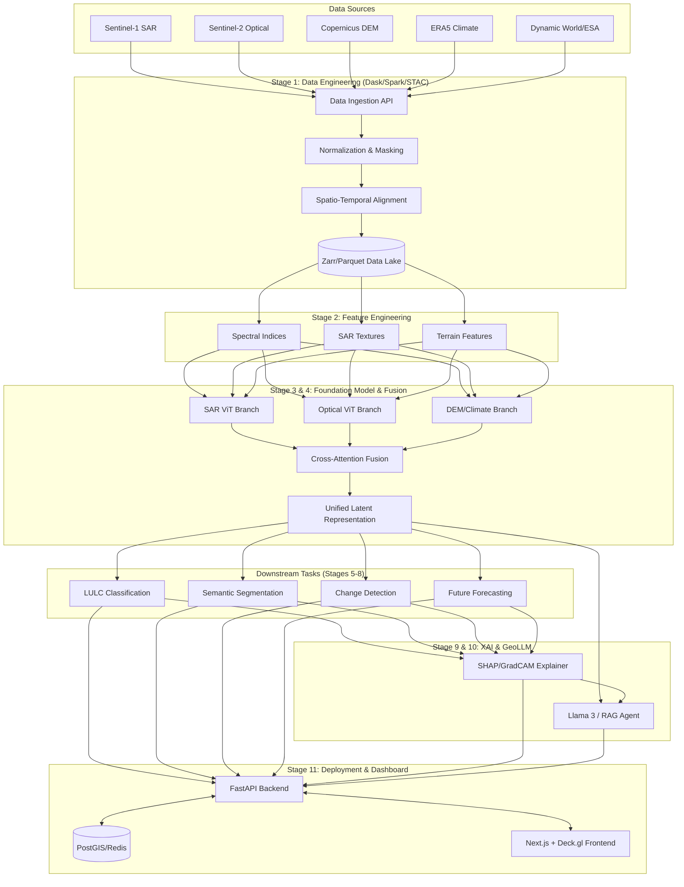

# GeoSentinel-X Architecture & Implementation Plan

This document outlines the architecture, implementation plan, and project roadmap for building a next-generation, research-grade Earth Observation Intelligence System that significantly exceeds the capabilities of SEN12MS.

## 1. System Architecture Diagram



## 2. Dataset Schema

**Zarr Array Structure for a 256x256 Tile:**

```json
{
  "tile_id": "12ABC_20230101_20231231",
  "spatial_extent": {
    "epsg": 32612,
    "bbox": [xmin, ymin, xmax, ymax]
  },
  "temporal_extent": ["2023-01-01T00:00:00Z", "2023-12-31T00:00:00Z"],
  "data": {
    "s1_sar": { "shape": [T, 2, 256, 256], "dtype": "float32", "bands": ["VV", "VH"] },
    "s2_opt": { "shape": [T, 13, 256, 256], "dtype": "float16", "bands": ["B01", "B02", ...] },
    "dem": { "shape": [1, 256, 256], "dtype": "float32", "bands": ["elevation"] },
    "climate": { "shape": [T, 4], "dtype": "float32", "vars": ["temp", "precip", "soil_m", "humidity"] },
    "labels_lulc": { "shape": [T, 1, 256, 256], "dtype": "uint8", "classes": 12 }
  }
}
```

## 3. Database Schema (PostGIS)

```sql
CREATE TABLE regions_of_interest (
    id SERIAL PRIMARY KEY,
    name VARCHAR(255),
    geom GEOMETRY(Polygon, 4326),
    created_at TIMESTAMP
);

CREATE TABLE inferences (
    id UUID PRIMARY KEY,
    roi_id INT REFERENCES regions_of_interest(id),
    task_type VARCHAR(50), -- 'LULC', 'CHANGE', 'FORECAST'
    model_version VARCHAR(50),
    result_s3_path VARCHAR(512),
    confidence_score FLOAT,
    timestamp TIMESTAMP
);
```

## 4. Training Pipeline Strategy

1.  **Distributed Dataloader:** Custom PyTorch `IterableDataset` reading from cloud Zarr stores using Dask for on-the-fly temporal interpolation and spatial augmentation.
2.  **Pretraining (Self-Supervised):**
    *   **Objective:** Masked Autoencoding (MAE) combined with DINOv2 self-distillation.
    *   **Strategy:** Mask 75% of optical patches, 50% of SAR patches. Reconstruct missing modalities and masked regions.
    *   **Hardware:** Distributed Data Parallel (DDP) across multiple GPU nodes.
3.  **Finetuning:**
    *   Freeze early transformer layers, train task-specific heads (FPN for segmentation, Siamese head for change detection) using Focal Loss and Dice Loss.

## 5. MLOps Architecture

*   **Version Control:** Git (code), DVC (data pointers and weights).
*   **Experiment Tracking:** MLflow / Weights & Biases.
*   **CI/CD:** GitHub Actions to run pytest (unit testing data loaders, model forward passes) and build Docker containers.
*   **Model Registry:** MLflow Model Registry to stage models (Dev -> Staging -> Production).
*   **Serving:** Seldon Core or KServe on Kubernetes for optimized GPU inference scaling.
